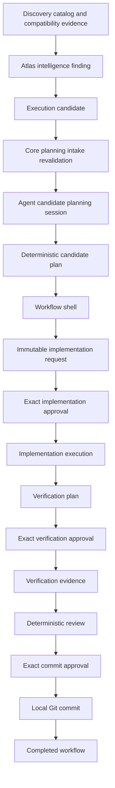

# Atlas Architecture

Atlas is a local-first, provider-neutral infrastructure control plane. It helps operators understand infrastructure, convert deterministic findings into candidate work, and execute only the narrow changes that receive explicit human approval.

The released Atlas v0.11 architecture has two separately gated execution
boundaries: repository execution remains `update-compose-stack`, and hardened
operational execution remains exactly `restart-service/proxmox/qemu`. Provider
Intent is monitoring-policy state and is not infrastructure execution.

Atlas does not push, tag, publish releases, deploy remotely, auto-approve, or auto-execute work.

## Subsystems and responsibilities

### Atlas Core

Atlas Core owns the authoritative system view and public platform API. It collects provider state, exposes Discovery Center catalog and compatibility evidence, prepares explainable intelligence findings for recommendations, projects execution candidates, performs planning-intake revalidation, owns Provider Intent authority, and owns hardened operational dispatch.

Atlas Core does not execute repository candidate work or grant approval for
Agent side effects. Operational dispatch is a separate, authenticated,
approval-gated subsystem restricted to the accepted capability tuple.

### Provider Intent

The activated schema-v2 Provider Intent Store is production authority for
supported Proxmox QEMU monitoring intent. Records bind to the
provider-authoritative resource incarnation; a reused VMID with a different
identity cannot inherit prior intent. Mutation is explicit and authenticated,
uses exact live-identity and compare-and-swap validation, and preserves durable
idempotency and operator-bound audit evidence.

LXC may remain visible in observed inventory, but it has no accepted
provider-authoritative incarnation identity and is unsupported for
identity-bound Provider Intent. Atlas does not synthesize an LXC identity.

### Discovery Center

Discovery Center owns implemented provider-neutral catalog facts and deterministic compatibility evidence as a runtime, read-only, curated-catalog-first subsystem. Future roadmap work remains for dynamic catalog sources, semantic discovery, and broader execution handoff affordances.

### Intelligence and execution candidates

Atlas intelligence consumes Discovery compatibility evidence and emits explainable recommendations. Execution candidate projection converts eligible recommendations into structured candidate records with stable identifiers and fingerprints.

### Atlas Agent

Atlas Agent owns local engineering orchestration. It creates candidate planning sessions, deterministic candidate plans, workflow shells, immutable implementation requests, verification plans, audit-chain validation, deterministic review, and local Git commits.

Agent state is local-first and file-backed under `ATLAS_AGENT_STATE_DIR`. Side-effect stages are approval-gated, persisted, restart-aware, and at-most-once.

### Mission Control

Mission Control is the operator UI. Public provider-management-v2 is canonical
for provider identity and monitoring state; authenticated provider-management-v3
adds only caller-specific mutation readiness. The Provider Intent editor keeps
observed state, monitoring intent, compatibility actions, and operational
maintenance distinct. Advisory suggestion Review changes local UI state only;
Save is the separate explicit Provider Intent mutation boundary. Mission Control
must not bypass Core or Agent authentication, permission, identity, approval, or
execution boundaries.

## Ownership boundaries

- Core owns candidate source authority and revalidation.
- Agent owns local workflow orchestration and side-effect gating.
- Mission Control owns presentation and user interaction.
- Core owns Provider Intent authority, mutation validation, and operational
  dispatch; neither advisory data nor UI state owns these authorities.
- External tools own their own effects, such as Codex implementation, Docker Compose verification, and Git.
- Operators own approval decisions.

## Trust boundaries

- Caller-controlled API bodies use strict request models and cannot supply commands, paths, evidence, or approval overrides for candidate side effects.
- Candidate execution starts only from Core-projected candidates and stable fingerprints.
- Implementation, verification, and commit approvals bind to exact immutable requests.
- Raw secrets, authorization headers, uncontrolled command output, and broad diffs must not be logged or persisted as public contract data.
- Local Git commit is the final implemented Phase 3 side effect. Push, tag, release, rollback, and remote deployment are outside v0.6 scope.
- Discovery proposals, ACE recommendations, and Provider Intent suggestions are
  advisory. They grant neither permission nor execution and cannot authorize
  mutation, approval, or dispatch.
- Provider Intent mutation does not invoke provider actions or operational
  dispatch. Monitoring intent causes no automatic remediation.

## Phase 3 pipeline

## Approval flow

Each side-effect stage has its own approval boundary.

1. Implementation approval authorizes one immutable implementation request with exact command, arguments, working directory, and evidence.
2. Verification approval authorizes one immutable verification plan with exact checks.
3. Commit approval authorizes one immutable commit request with exact branch, HEAD, reviewed files, fingerprint, and message.

Rejected, mismatched, missing, or stale approvals block the workflow. Empty-command approval records cannot authorize execution. Later-generated work cannot inherit an earlier approval.

## Restart behavior

Planning, workflow conversion, implementation translation, execution, verification, review, and commit artifacts are persisted. Approval-wait states restore unchanged. Completed and blocked workflows restore unchanged with their artifacts. Interrupted side-effect states such as executing, verifying, and committing recover as blocked rather than replaying the side effect.

Aggregate snapshots are atomic and versioned. Corrupt, unsupported, or partially written active snapshots fail safely instead of silently resuming unsafe state.

## Audit chain

Candidate workflows preserve machine-readable links across:

- finding identity
- execution candidate ID and fingerprint
- candidate planning session ID
- candidate plan ID and fingerprint
- workflow ID and candidate metadata
- implementation request and approval IDs
- execution result
- verification plan, approval, and evidence IDs
- candidate review result and generic review report
- commit request, approval, result SHA, and committed files

Audit validation uses identifiers and fingerprints, never rationale, titles, descriptions, or recommendation prose.

## Released v0.11 execution boundaries

- Repository execution: `update-compose-stack` candidate workflows ending in a
  local Git commit.
- Operational execution: exactly `restart-service/proxmox/qemu` through the
  hardened operational request, approval, dispatch, and verification path.

Provider Intent updates are explicit authenticated control-plane mutations, not
execution capabilities. Discovery, ACE, and suggestion reads do not expand the
two execution boundaries. Automatic approval, automatic execution, automatic
remediation, LXC operational execution, arbitrary provider operations, push,
tag, release publication, remote deployment, and rollback automation remain
unsupported production capabilities.

## Historical v0.6 operation boundary

Supported in v0.6:

- `update-compose-stack` candidate workflows that end in a local Git commit.

Not supported in v0.6:

- `restart-service`
- `backup`
- `restore`
- `install-provider`
- `update-image`
- push
- tag
- release publication
- remote deployment
- rollback automation
- automatic approval
- automatic execution
